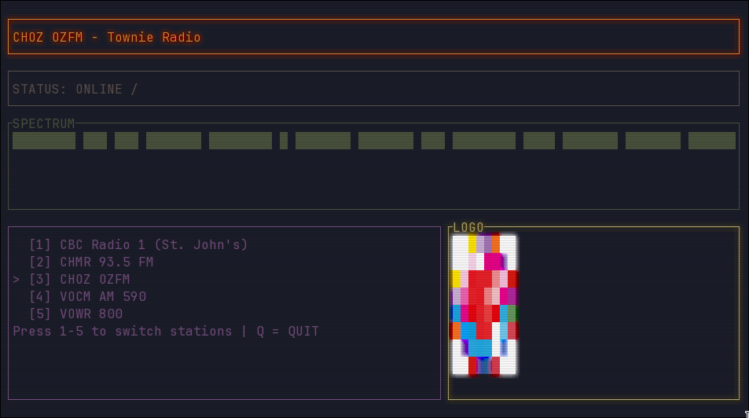

# 📻 TownieRadio

A minimal, terminal-based radio streamer for local **St. John's, Newfoundland & Labrador** stations.

TownieRadio is a lightweight Rust TUI app that lets you stream local radio directly from your terminal with a retro pixel-art vibe.



---

## ✨ Features

- 🎧 Stream local St. John's radio stations
- 🖥 Retro terminal UI (built with `ratatui`)
- 🎨 Pixelated station logos
- 📡 Live status (LOADING / ONLINE / OFFLINE)
- 📊 Animated spectrum display
- ⌨ Simple keyboard controls

---

## 📡 Included Stations

- CBC Radio 1 (St. John's)
- CHMR 93.5 FM
- CHOZ OZFM
- VOCM AM 590
- VOWR 800
- HOT 99.1 FM
- K-Rock 97.5

Stations and logos are embedded into the binary at compile time. To add a station, drop a PNG into `logos/`, add an entry to `stations.json`, then rebuild:

```json
{
  "name": "My Station",
  "url": "https://example.com/stream",
  "logo_path": "logos/MyStation.png"
}
```

---

## 🛠 Requirements

- Rust (latest stable recommended)
- `ffplay` (from FFmpeg)

### Install Rust

```bash
curl https://sh.rustup.rs -sSf | sh
```

### Clone the repository

```bash
git clone https://github.com/Striss/townie_radio
cd townie_radio
```

### Run the app
```bash
cargo run
```

### Build a standalone binary

All assets (station list and logos) are compiled directly into the binary — no external files needed at runtime.

```bash
cargo build --release
```

The self-contained executable will be at `target/release/townieradio`.
